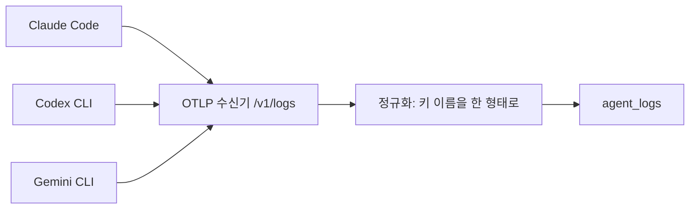
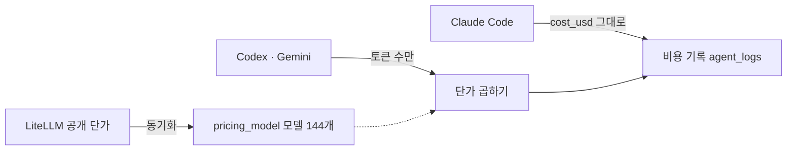
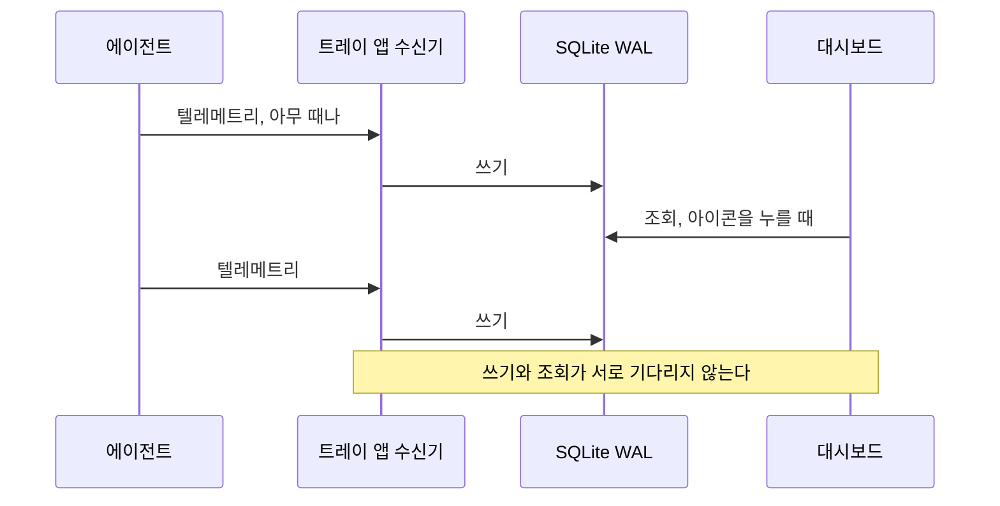

AI 코딩 에이전트 세 개를 프로젝트마다 다르게 쓰고, 어떤 날은 토큰을 몇 백만 개씩 태운다. 그런데 이번 달 이 프로젝트에 얼마를 썼는지는 어디서도 확인되지 않았다. 대시보드는 도구별로 흩어져 있고 프로젝트 단위 집계는 어느 쪽도 제공하지 않아서, 세 도구의 텔레메트리를 한곳에 받아 프로젝트별로 모으는 앱을 만들었다.

<Points />

<Kind>아키텍처</Kind>

## 세 도구 모두 OpenTelemetry로 내보내서 수신기는 하나면 된다

Claude Code, Codex CLI, Gemini CLI는 모두 OpenTelemetry로 텔레메트리를 내보낼 수 있다. 표준 하나만 받으면 도구마다 사설 API를 붙이지 않아도 되므로, OTLP 로그를 받는 `/v1/logs` 엔드포인트 하나를 열고 세 도구가 이 주소를 가리키게 했다.



세 도구 모두 텔레메트리가 기본으로 꺼져 있고 전송 형식 기본값이 gRPC/protobuf라서, 아래 설정을 빠뜨리면 수신기에 아무것도 오지 않는다.

| 도구 | 텔레메트리 켜기 | 전송 형식 |
|---|---|---|
| Claude Code | `CLAUDE_CODE_ENABLE_TELEMETRY=1`, `OTEL_LOGS_EXPORTER=otlp` | `OTEL_EXPORTER_OTLP_PROTOCOL=http/json` |
| Codex CLI | `CODEX_OTEL_EXPORT_ENABLED=true` | `OTEL_EXPORTER_OTLP_PROTOCOL=http/json` |
| Gemini CLI | `GEMINI_TELEMETRY_ENABLED=true`, `GEMINI_TELEMETRY_TARGET=local` | `GEMINI_TELEMETRY_OTLP_PROTOCOL=http` |

프로젝트는 리소스 속성 `project.name`으로 받는다. 이 값이 비어 오면 세션의 작업 경로를 프로젝트 등록표와 대조하고, 같은 세션의 앞선 레코드가 이미 프로젝트를 알면 그 값을 이어 쓴다.

```ts
// app/v1/logs/route.ts (요점만 남긴 축약본)
export async function POST(request: Request) {
  const payload = await request.json();
  // 도구마다 토큰 키 이름이 달라서 한 형태로 맞춘다
  const records = flattenResourceLogs(payload);

  for (const record of records) {
    await insertLog({
      // service.name으로 claude-code · codex · gemini-cli를 가른다
      agent: detectAgentType(record.serviceName),
      // project.name이 비면 같은 세션의 앞선 레코드에서 채운다
      project: record.projectName,
      inputTokens: record.inputTokens,
      outputTokens: record.outputTokens,
    });
  }

  return Response.json({ accepted: records.length });
}
```

도구를 하나 더 쓰기 시작해도 수신기와 저장 쪽은 손대지 않고, 서비스 이름 매핑과 키 정규화만 몇 줄 늘리면 된다.

<Kind>핵심 구현</Kind>

## Codex와 Gemini는 비용 대신 토큰 수만 보낸다

Claude Code는 텔레메트리에 `cost_usd`를 실어 보내므로 그 값을 그대로 저장한다. Codex CLI와 Gemini CLI는 토큰 수만 보내서, 수신 시점에 모델 단가를 곱해 같은 비용 칸에 넣는다.



단가표를 손으로 유지하면 모델이 새로 나올 때마다 낡는다. 그래서 `pricing_model` 테이블은 LiteLLM이 공개하는 모델 단가 JSON에서 동기화하고, 접두어 규칙(`gpt-`, `o3`, `gemini/`)에 걸리는 모델 144개만 가져와 같은 규칙으로 에이전트에 자동 매핑한다.

단가가 바뀌어도 이미 저장된 과거 행은 다시 계산하지 않는다. 청구는 수신 당시 단가로 이루어졌으므로 기록도 그 값이 맞다. 다만 Codex와 Gemini의 비용은 입력·출력·캐시 읽기 단가만 곱한 근사값이다.

<Kind>핵심 구현</Kind>

## 대시보드를 열어 둔 동안만 수집하면 집계가 빈다

에이전트는 터미널에서 아무 때나 돌아서, 대시보드를 띄워 둔 순간에만 수집하면 그 밖의 시간이 집계에서 빠진다. 그래서 수집기를 Electron 트레이 앱으로 상주시켰다. 백그라운드에서 OTLP 수신기가 돌고, 메뉴바 아이콘을 누르면 그때 대시보드가 뜬다.



수집과 조회가 각자 커넥션으로 DB를 열면, 기본 저널 모드에서는 대시보드 쿼리가 도는 동안 쓰기가 기다리고 조회가 길어지면 수집이 밀린다. WAL 모드는 쓰기를 별도 로그에 쌓아서 읽기와 쓰기가 서로를 기다리지 않는다.

```ts
// 대시보드 조회가 길어져도 수집이 밀리지 않게
db.pragma("journal_mode = WAL");
```

<Kind>결과</Kind>

## 어디에 얼마 썼는지 숫자로 보인다

몇 주 치 데이터가 쌓이자 누적 546.1M 토큰에 $430.66이라는 총액이 나왔다. 이번 달 이 프로젝트에 얼마를 썼는지, 입력과 출력 중 어느 쪽 토큰이 비용을 만드는지, 같은 작업에 어느 도구가 덜 드는지를 이제 대시보드에서 바로 읽는다. 셋 다 도구별 대시보드에서는 보이지 않던 값이다.

<Shot
  src="/work/argus.webp"
  width={1280}
  height={900}
  alt="Argus 대시보드. 오늘 비용, 에이전트별 사용 히트맵, 프로젝트 이름이 붙은 최근 세션, 누적 546.1M 토큰과 $430.66이 보인다"
  pins={[
    { x: 26.5, y: 5, title: "오늘 비용", text: "두 경로로 들어온 비용의 합" },
    { x: 61.5, y: 27, title: "사용 히트맵", text: "세 도구를 색으로 나눈 한 달력" },
    { x: 60.5, y: 53, title: "최근 세션", text: "세션마다 붙는 프로젝트 이름" },
    { x: 80.5, y: 88.4, title: "누적 합계", text: "546.1M 토큰, $430.66" },
  ]}
/>

<Retro>

Codex와 Gemini의 비용이 근사값이라는 점과, 도구가 늘 때마다 정규화 코드를 손봐야 한다는 점은 아직 남은 과제다. 비용 최적화도 성능 작업과 같아서, 어디가 비싼지 측정한 뒤에야 줄일 곳을 고를 수 있다.

</Retro>
