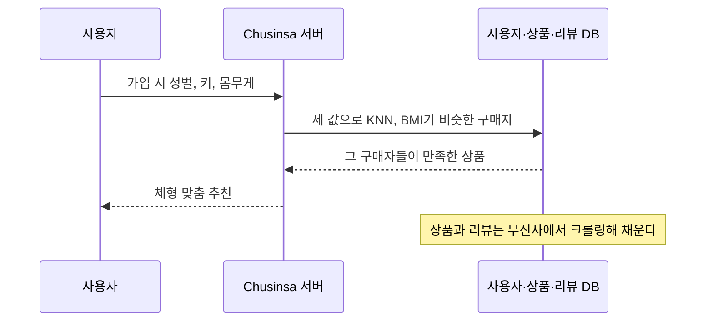

기존 쇼핑몰의 추천은 구매 이력과 클릭을 바탕으로 해서, 기록이 없는 신규 사용자에게는 쓸 만한 추천을 주지 못한다. Chusinsa는 가입할 때 받은 성별, 키, 몸무게로 첫 방문부터 체형에 맞는 옷을 추천하는 쇼핑몰이다. 5인 팀에서 프론트엔드(Next.js)와 백엔드(FastAPI, MySQL) 전반을 맡았다.

<Points />

<Kind>아키텍처</Kind>

## 성별, 키, 몸무게로 비슷한 체형의 구매자를 찾는다

가입할 때 성별, 키, 몸무게를 받는다. 추천은 이 세 값을 변수로 KNN을 적용해 BMI가 비슷한 구매자들을 찾고, 그들이 남긴 리뷰에서 만족도가 높은 상품을 고른다. 상품과 리뷰 데이터는 무신사에서 크롤링해 사용자·상품·리뷰 DB에 넣었다.

<Kind>핵심 구현</Kind>

## 검색 화면은 카테고리, 사이즈, 가격 필터가 서로 얽힌다

크롤링한 상품 데이터 규모가 커서 데이터베이스 정규화에 특히 공을 들였다. 화면 쪽에서는 카테고리, 사이즈, 가격 필터가 서로 얽히는 검색 화면의 상태 관리를 설계했다. 체형 기반 추천 결과는 "Recommend Top", "Recommend Pants"라는 카테고리로 일반 카테고리와 나란히 목록에 들어간다.

<Shot
  src="/work/chusinsa.webp"
  width={1600}
  height={1030}
  alt="Chusinsa 상품 목록. 왼쪽에 Top, Pants, Recommend Top, Recommend Pants 카테고리와 가격·사이즈 필터가 있고 오른쪽에 바지 상품이 나열된다"
  pins={[
    { x: 23.8, y: 51.5, title: "추천 카테고리", text: "체형 기반 추천이 일반 카테고리와 나란히 선다" },
    { x: 30.5, y: 67.2, title: "가격 필터", text: "가격 범위로 목록을 좁힌다" },
    { x: 29.5, y: 88.7, title: "사이즈 필터", text: "사이즈로 목록을 좁힌다" },
  ]}
/>

<Retro>

열정적인 팀원들과 함께한 첫 규모 있는 협업 프로젝트였다. 화면과 데이터 모델이 서로를 어떻게 제약하는지, 풀스택 관점의 기초를 여기서 다졌다.

</Retro>
