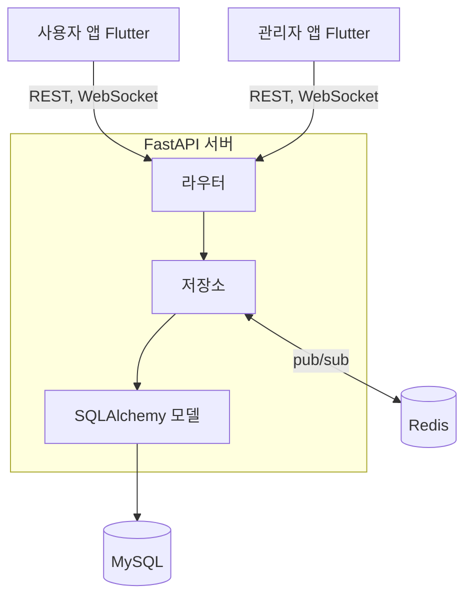
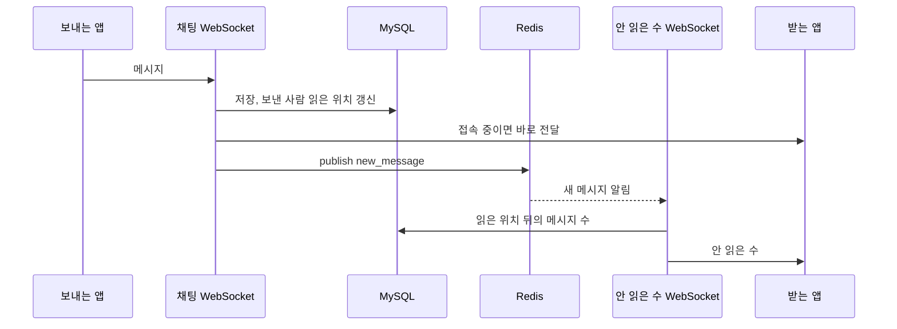

척수 장애인은 꾸준한 건강 관리 과제와 전문가 상담이 함께 필요하지만, 이를 하나의 흐름으로 묶어 주는 모바일 앱은 찾기 어려웠다. Let'sdo는 사용자가 매일 과제를 기록하고 상담사와 채팅하는 건강관리 앱이다. 사용자 앱과 관리자 앱을 Flutter로, API 서버를 FastAPI로 만들었고 셋 다 혼자 개발했다.

<Points />

<Kind>아키텍처</Kind>

## 앱 두 개가 API 서버 하나를 같이 쓴다

사용자 앱과 관리자 앱은 같은 FastAPI 서버를 쓴다. 서버는 기능별 라우터(인증, 사용자, 프로필, 체크리스트, 할 일, 채팅방, 메시지)가 저장소 계층을 거쳐 SQLAlchemy 모델로 MySQL에 접근하는 구조다. 인증은 JWT로 하고, WebSocket 연결도 쿼리로 받은 토큰으로 사용자를 확인한다.



<Kind>핵심 구현</Kind>

## 안 읽은 메시지 수는 Redis로 새 메시지를 알려 다시 센다

채팅은 메시지마다 WebSocket으로 받는다. 서버는 받은 메시지를 저장하고, 보낸 사람의 읽은 위치(`last_read_message_id`)를 그 메시지로 옮긴 뒤, 접속해 있는 두 사람에게 바로 보낸다. 그다음 Redis `new_message` 채널에 새 메시지가 왔다고 발행한다.

목록 화면의 안 읽은 메시지 수는 별도 WebSocket이 맡는다. 이 연결은 `new_message` 채널을 구독하다가 새 메시지가 오면, 읽은 위치보다 뒤에 있는 메시지 수를 다시 세서 보낸다.



```python
# repository/message.py (요점만 남긴 축약본)
while True:
    content = await websocket.receive_text()
    message = Message(content=content, user_id=current_user.id, chatroom=chatroom)
    db.add(message)
    db.commit()

    # 보낸 사람은 자기 메시지까지 읽은 것으로 친다
    participant.last_read_message_id = message.id
    db.commit()

    # 접속해 있는 두 사람에게는 바로 보낸다
    for user_id in [message_to, current_user.id]:
        if user_id in connected_chat_clients:
            await connected_chat_clients[user_id].send_text(json.dumps(payload))

    # 안 읽은 수를 세는 연결들에 새 메시지를 알린다
    await redis.publish("new_message", json.dumps({"content": content}))
```

<Kind>결과</Kind>

## 사용자와 상담사가 같은 기록을 서로 다른 화면으로 본다

사용자는 오늘 할 일 가운데 몇 개를 마쳤는지와 이번 주 요일별 달성도를 본다. 관리자 앱에서는 상담사가 담당 사용자 한 명의 오늘 달성도와 주차별 항목 기록을 보고, 같은 화면에서 채팅으로 넘어간다. 두 앱은 같은 체크리스트 기록을 읽고, 화면만 역할에 맞게 다르다.

<Screens
  images={[
    { src: "/work/letsdo1.webp", width: 483, height: 804, alt: "사용자 앱 홈. 오늘 할 일 10개 중 7개 완료, 이번 주 요일별 달성도, 상담하기와 공지사항 바로가기" },
    { src: "/work/letsdo2.webp", width: 484, height: 808, alt: "관리자 앱에서 본 사용자 김준수 님의 오늘 달성도 0/10과 10월 4주차 항목별 달성도 표" },
  ]}
  caption="왼쪽은 사용자 앱, 오른쪽은 관리자 앱에서 본 한 사용자의 기록이다."
/>

<Retro>

첫 Flutter 프로젝트였고, WebSocket 실시간 통신을 깊게 다뤄 본 작업이다. 사용자, 관리자, 서버 세 쪽의 상태를 맞추면서 실시간 시스템의 상태 설계를 배웠다.

</Retro>
