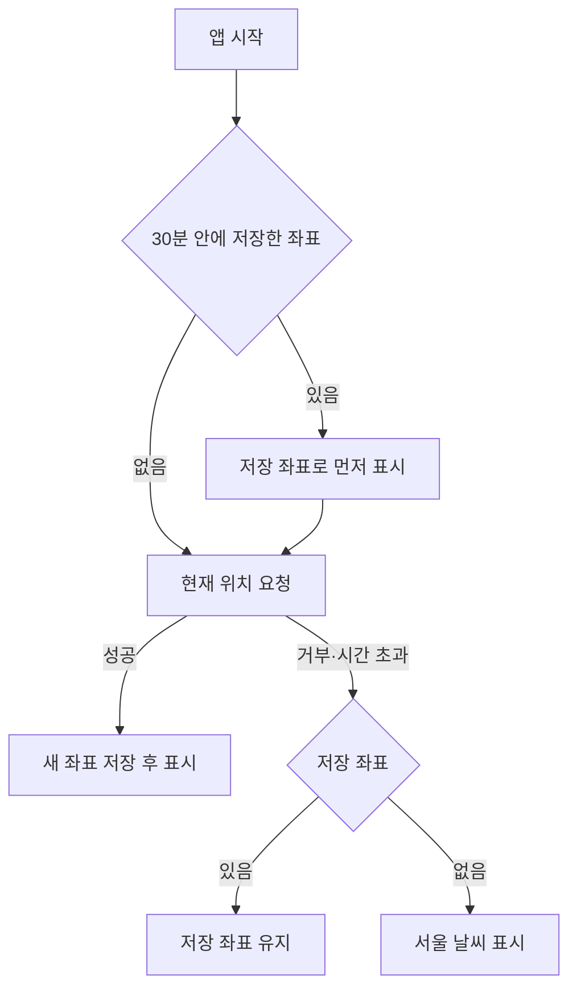

날씨 앱은 많지만 대부분 광고와 정보가 넘쳐서, 지금 필요한 날씨 하나를 보려고 여러 화면을 거쳐야 한다. Malgoum은 검색, 즐겨찾기, 시간대별 예보만 남기고 나머지를 덜어 낸 날씨 앱이다. 기능이 적은 만큼 위치를 정하는 순서, 검색, 캐시처럼 매번 거치는 경로를 프로덕션 수준으로 다듬는 데 집중했다.

<Points />

<Kind>아키텍처</Kind>

## 코드를 여섯 계층으로 나누고 아래쪽으로만 의존하게 했다

프로젝트는 Feature-Sliced Design을 따라 `app`, `pages`, `widgets`, `features`, `entities`, `shared` 여섯 계층으로 나뉜다. 위 계층은 아래 계층만 가져다 쓸 수 있어서, 화면을 고칠 때 데이터 코드를 건드리지 않고 데이터 쪽을 고칠 때 화면 코드를 건드리지 않는다.

| 계층 (위에서 아래로만 의존) | 들어 있는 것 |
|---|---|
| `app` | Jotai, TanStack Query 프로바이더 |
| `pages` | 홈, 날씨 상세 |
| `widgets` | 즐겨찾기 목록, 날씨 정보 |
| `features` | 위치 검색, 즐겨찾기 관리, 현재 위치, 테마 전환 |
| `entities` | weather, location, favorite |
| `shared` | ky API 클라이언트, 설정, 훅 |

날씨는 OpenWeatherMap에서, 좌표를 지명으로 바꾸는 일은 네이버 역지오코딩 API에서 가져온다. 두 API를 쓰는 `weather`와 `location` 엔티티는 API 응답(dto)을 앱 안의 모델로 바꾸는 매퍼를 거치므로, 응답 형식이 바뀌어도 매퍼 안에서 끝난다.

<Kind>핵심 구현</Kind>

## 위치는 저장된 좌표, 현재 위치, 서울 순서로 정한다

앱을 열면 30분 안에 저장해 둔 좌표가 있는지 먼저 본다. 있으면 그 좌표로 날씨를 먼저 보여 주고, 동시에 브라우저에 현재 위치를 요청한다. 요청이 성공하면 새 좌표를 저장해 화면을 바꾸고, 권한이 거부되거나 시간이 초과되면 저장된 좌표를, 그것도 없으면 서울을 쓴다.



브라우저 위치 요청은 정확도를 높이고, 10초가 지나면 실패로 보고, 5분 안에 얻은 위치는 다시 쓰도록 옵션을 준다. 아래는 위치 권한을 거부했을 때의 화면이다.

<Shot
  src="/work/malgoum.webp"
  width={1280}
  height={800}
  alt="위치 권한이 거부되어 기본 위치인 서울의 날씨를 보여 주는 Malgoum 홈 화면. 재시도 버튼과 장소 검색, 비어 있는 즐겨찾기가 보인다"
  pins={[
    { x: 10, y: 45.6, title: "권한 거부 안내", text: "서울 날씨를 대신 보여 준다고 알린다" },
    { x: 76.5, y: 45.6, title: "재시도", text: "폴백을 풀고 위치를 다시 요청한다" },
    { x: 24.5, y: 66, title: "현재 날씨", text: "폴백 좌표로 불러온 서울의 날씨" },
  ]}
/>

<Kind>트러블슈팅</Kind>

## 개발 모드에서 위치 요청이 두 번씩 나가던 이유

React StrictMode는 개발 모드에서 이펙트를 한 번 더 실행해 정리 누락을 드러낸다. 앱을 열 때 현재 위치를 요청하는 이펙트도 두 번 돌아서 위치 요청이 두 번 나갔다.

요청 중인지를 `useRef` 플래그로 기억해 두 번째 요청을 건너뛰고, 서울로 대신 보여 주는 폴백에도 같은 플래그를 달아 한 번만 적용되게 했다. 재시도 버튼을 누를 때만 폴백 플래그를 풀어 다시 요청한다.

```ts
// shared/hooks/use-geolocation.ts (요점만 남긴 축약본)
const isRequestingRef = useRef(false);

const getCurrentPosition = useCallback(() => {
  // StrictMode가 이펙트를 두 번 돌려도 요청은 한 번만 보낸다
  if (isRequestingRef.current) return;
  isRequestingRef.current = true;

  navigator.geolocation.getCurrentPosition(
    (position) => {
      isRequestingRef.current = false;
      // 좌표 저장
    },
    (error) => {
      isRequestingRef.current = false;
      // 오류 메시지 저장
    },
    GEOLOCATION_OPTIONS,
  );
}, []);
```

<Kind>핵심 구현</Kind>

## 초성만 입력해도 행정구역을 찾는다

장소 검색은 외부 API를 부르지 않고, 앱에 넣어 둔 행정구역 데이터(`korea_districts.json`)에서 찾는다. 입력은 300ms 디바운스를 거치고, 띄어쓰기와 구분 기호를 지운 뒤 초성 일치와 글자 포함 여부를 함께 본다. `es-hangul`의 `getChoseong`으로 지명의 초성을 뽑아서 "ㅅㅇ"만 입력해도 서울이 걸린다.

```ts
// entities/location/lib/search-districts.ts (요점만 남긴 축약본)
for (const district of districts) {
  // 목록이 길어지지 않게 20개에서 끊는다
  if (results.length >= 20) break;

  const name = district.raw.replace(/-/g, "").replace(/\s+/g, "");
  // 'ㅅㅇ'처럼 초성만 쳐도 '서울'이 걸리게 한다
  const isChosungMatch = getChoseong(name).includes(query);
  const isTextMatch = name.includes(query);

  if (isChosungMatch || isTextMatch) results.push(district);
}
```

<Kind>핵심 구현</Kind>

## 날씨는 좌표와 단위가 같으면 10분 동안 다시 부르지 않는다

날씨 요청은 TanStack Query로 캐시하고, `jotai-tanstack-query`로 현재 좌표 atom과 묶었다. 쿼리 키에 좌표와 온도 단위를 넣어서, 위치나 단위가 바뀔 때만 새로 요청한다.

| 설정 | 값 |
|---|---|
| 쿼리 키 | 좌표 + 온도 단위 |
| `staleTime` | 10분 |
| `gcTime` | 30분 |
| `retry` | 2회 |

즐겨찾기는 jotai의 `atomWithStorage`로 localStorage에 저장하고, 목록 순서는 dnd-kit으로 끌어서 바꾼다. 새로고침해도 즐겨찾기와 순서가 그대로 남는다.

<Retro>

작은 앱이라도 프로덕션 품질로 유지하는 것이 목표였다. 기능을 검색, 즐겨찾기, 예보 셋으로 줄인 만큼 위치 권한 거부나 요청 시간 초과처럼 날씨를 보여 주지 못하는 경로를 먼저 채웠다.

</Retro>
